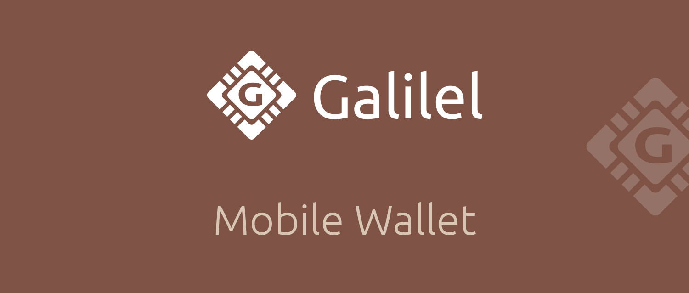
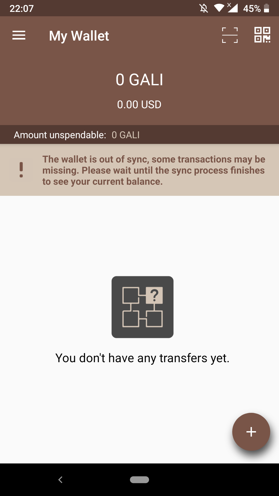
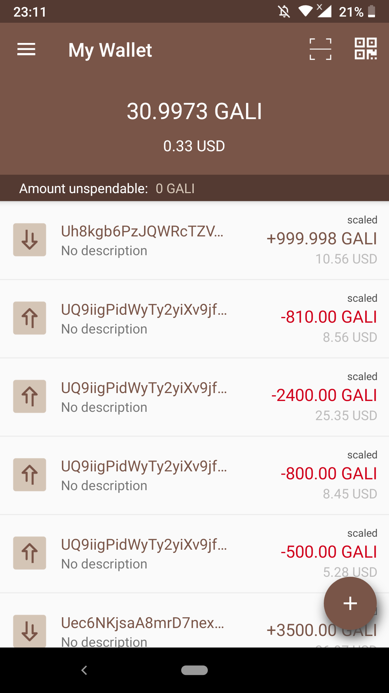
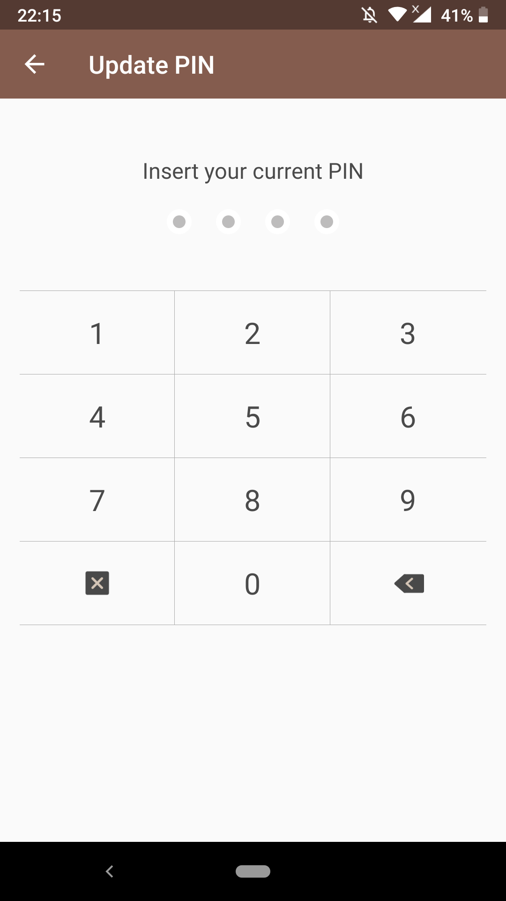
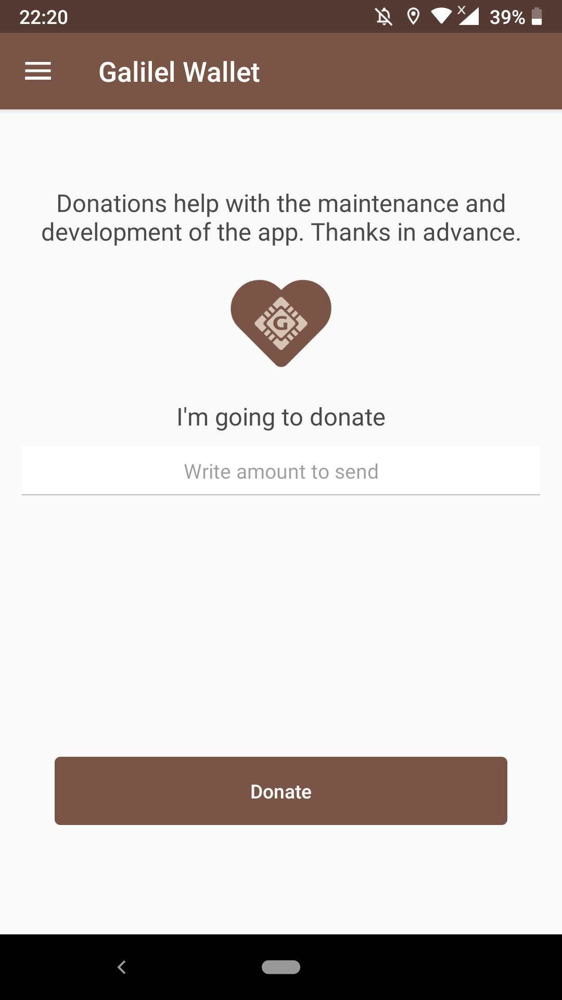
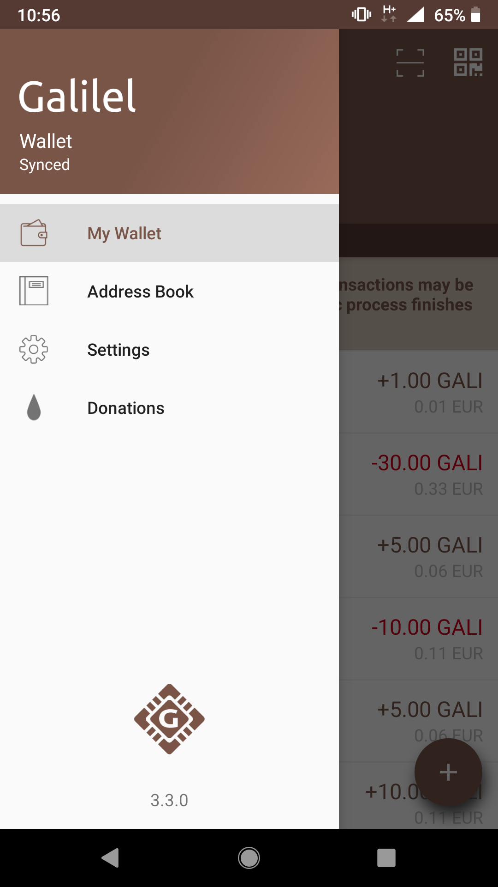
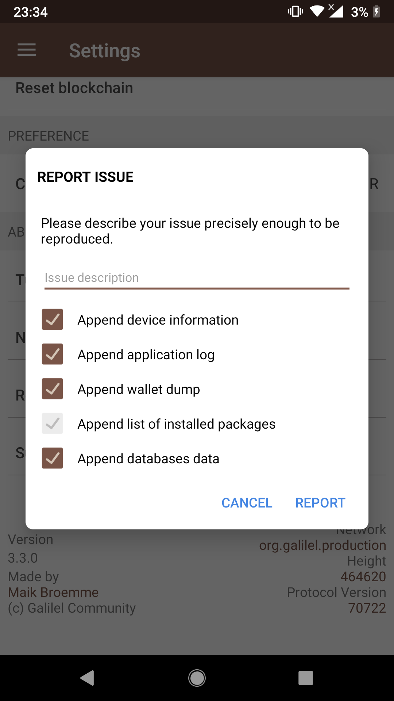

# Galilel Android Wallet



Welcome to the Galilel mobile wallet for Android!

This project contains several sub-projects:

* app: The Android app itself. This is probably what you're searching for.
* mobile: Stratum protocol implementation.

You can build all sub-projects at once using Gradle:

```
gradle clean build
```

# Wallet Screenshots

|  |  |  |
|-----------------------------------|-----------------------------------|-----------------------------------|
|  |  |  |
